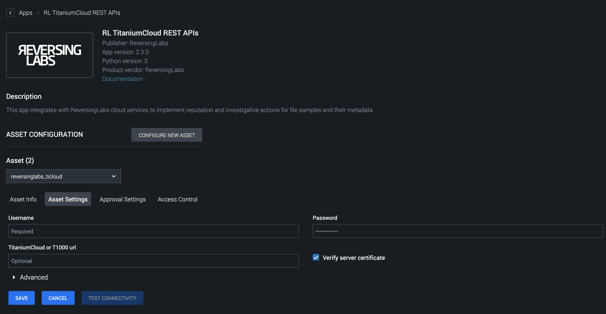

[comment]: # " File: README.md"
[comment]: # "  Copyright (c) ReversingLabs Inc 2016-2022"
[comment]: # ""
[comment]: # "Licensed under the Apache License, Version 2.0 (the 'License');"
[comment]: # "you may not use this file except in compliance with the License."
[comment]: # "You may obtain a copy of the License at"
[comment]: # ""
[comment]: # "    http://www.apache.org/licenses/LICENSE-2.0"
[comment]: # ""
[comment]: # "Unless required by applicable law or agreed to in writing, software distributed under"
[comment]: # "the License is distributed on an 'AS IS' BASIS, WITHOUT WARRANTIES OR CONDITIONS OF ANY KIND,"
[comment]: # "either express or implied. See the License for the specific language governing permissions"
[comment]: # "and limitations under the License."
[comment]: # ""
# ReversingLabs TitaniumCloud File Reputation

This app implements the investigative action 'file reputation' on the ReversingLabs TitaniumCloud
file reputation service. Information includes ReversingLabs Malware Presence information and
Anti-Virus scanner information.  
  
The ReversingLabs TitaniumCloud File Reputation, part of ReversingLabs Threat Intelligence provides
up-to-date file reputation, Anti-Virus scan information and internal analysis information on
billions of goodware and malware samples.  
  
Malware samples are continually reanalyzed to ensure that the reputation information is relevant at
all times.  
  
In addition to file reputation and historical AV reputation, additional Threat Intelligence can be
obtained from TitaniumCloud via multiple APIs and Feeds, which allow users to search for files by
hash or anti-virus detection name. It is also possible to hunt for files from a single malware
family, search for functionally similar samples, perform bulk queries, and receive alerts on file
reputation changes.  
  
For more information, consult the [official product
website.](https://www.reversinglabs.com/products/file-reputation-service.html)

## How to Configure the App

Access the Asset Settings tab on the Asset Configuration page. The variables described in the
previous section are displayed in this tab.  
  
  
  
Input the username and password required to connect to ReversingLabs TitaniumCloud File Reputation
service.  
  
  
Select the "Verify server certificate" checkbox to ensure that the self-signed certificates are not
accepted.

Note: Action parameter 'hunting report vault id' expects JSON type of content from file.

**Playbook Backward Compatibility**

Following new actions have been added:

-   certificate analytics
-   uri statistics
-   file similarity analytics
-   advanced search
-   joe sandbox adapter

## Port Information

The app uses HTTP/ HTTPS protocol for communicating with the RL TitaniumCloud REST APIs server.
Below are the default ports used by the Splunk SOAR Connector.

| SERVICE NAME | TRANSPORT PROTOCOL | PORT |
|--------------|--------------------|------|
| http         | tcp                | 80   |
| https        | tcp                | 443  |
